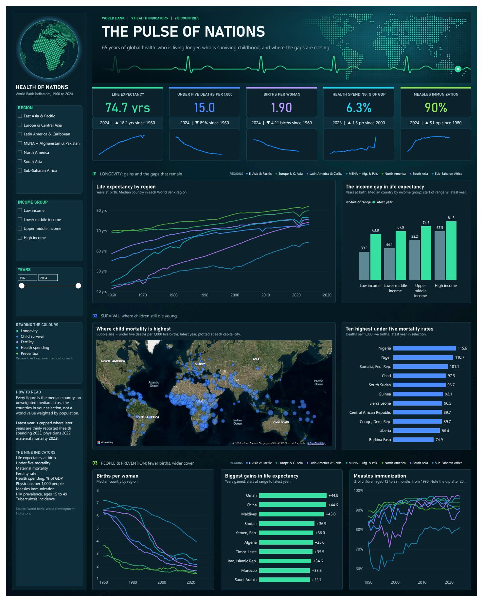
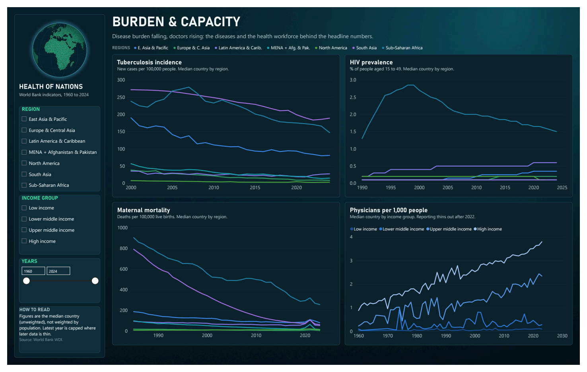
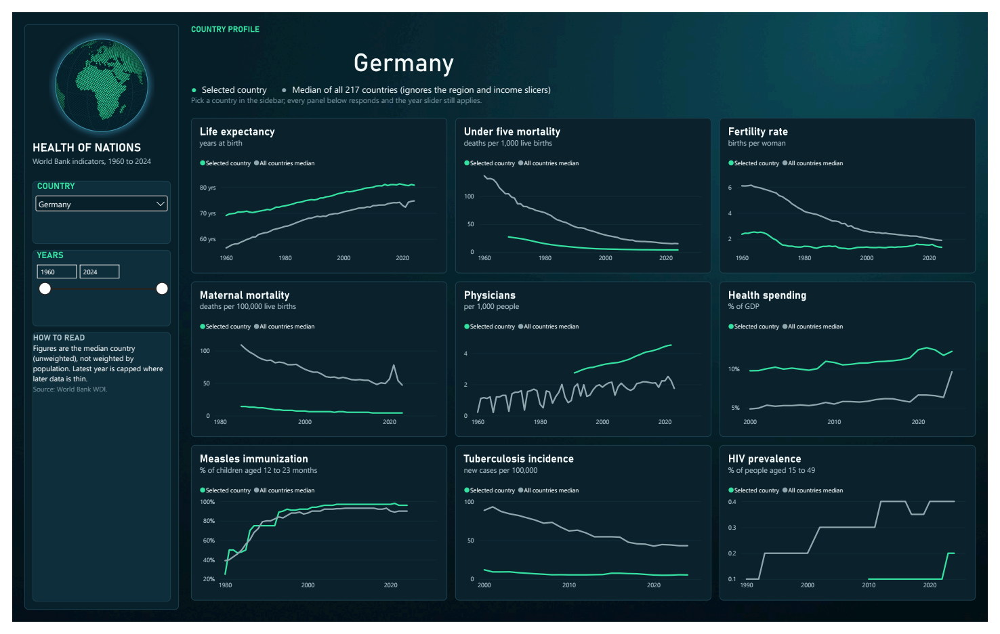

# World Bank Health Indicators

Global health outcomes across 217 countries (1960–2024), pulled directly from
the [World Bank Indicators API](https://datahelpdesk.worldbank.org/knowledgebase/articles/889392)
— no API key or account required — and turned into a three-page Power BI
dashboard, **The Pulse of Nations**.

## Preview

**Overview** — headline KPIs, life expectancy by region, the income gap,
child mortality, and prevention.



**Burden & Capacity** — the diseases (TB, HIV, maternal mortality) and the
health workforce behind the headline numbers.



**Country Profile** — pick any country; nine small charts compare it with the
median of all 217 countries. Shown here for Germany.



## What the data says

Every figure below is the **median country** (an unweighted median, not a
population-weighted world value), read from the dashboard and re-checked
against `data/health_indicators.csv`.

### The world got healthier, by a lot

- **Life expectancy rose from 56.5 to 74.7 years** between 1960 and 2024 (+18.2).
- **Under-5 mortality fell 89%**, from 137 to 15 deaths per 1,000 live births.
- **Births per woman fell from 6.1 to 1.9.** Every region has come down.
- **Measles immunization went from 39% (1980) to 90% (2024)**, and health
  spending crept up from 4.85% to 6.34% of GDP (2000 to 2023).

### The gaps are closing, but they are still wide

- The life expectancy gap between low and high income countries **shrank from
  28.3 to 17.5 years**. Low income countries gained the most (39.2 to 63.8,
  +24.6 years) against +13.8 for high income countries (67.5 to 81.3).
- Sub-Saharan Africa is the outlier on almost every measure: life expectancy of
  64 years (North America: 82), 49 under-5 deaths per 1,000 (Europe & Central
  Asia: 3.9), 257 maternal deaths per 100,000 (Europe & Central Asia: 6),
  3.9 births per woman, and measles cover of 81% (the other regions sit between about 90%
  and 97%).
- **All ten of the highest under-5 mortality rates are in Sub-Saharan Africa**,
  led by Nigeria (115.6) and Niger (110.7), about eight times the global median.
- The largest life expectancy gains since 1960 came from low starting points:
  Oman (+44.8), China (+44.6) and the Maldives (+43.0).

### Disease burden and workforce

- **Tuberculosis** is concentrated in South Asia (189 new cases per 100,000)
  and Sub-Saharan Africa (147, down from a 2007 peak of 279), against a global
  median of 43.
- **HIV prevalence** is essentially a Sub-Saharan Africa story: the regional
  median peaked at 2.85% around 1998 and is 1.5% today; no other region
  exceeds 0.6%.
- **Maternal mortality** fell sharply everywhere. South Asia went from 610 to
  64 per 100,000 (1990 to 2023) and Sub-Saharan Africa from 757 to 257, which is
  a two thirds drop but still about three times the next highest region (East Asia & Pacific, 82).
- **Physicians per 1,000 people** track income almost one for one: 0.12 in low
  income countries against 3.65 in high income ones, roughly a 30x gap.
  Sub-Saharan Africa sits at 0.18 and South Asia at 0.64.
- **Progress can slip.** The 2020 to 2021 dip in life expectancy is visible in
  most regions, and the Latin America & Caribbean and East Asia & Pacific
  measles medians fell from 94% (2019) to 90 to 91% (2024).

### Country profile: Germany

Germany compares favourably with the median country on every health outcome,
but the interesting part is how the gap has moved:

- **Life expectancy 80.8 vs 74.7 years.** In 1960 the gap was 12.5 years
  (69.1 vs 56.5); it is now 6.1, because the rest of the world caught up faster.
  Germany itself has plateaued since 2019 (81.3, then 80.6 in 2022, 80.8 in 2024).
- **Under-5 mortality 3.7 vs 15.0** per 1,000, and **maternal mortality 4 vs 47**
  per 100,000 (2023).
- **Fertility 1.36 vs 1.90** births per woman, and it has stayed at or below
  1.6 since 1975.
- **Health spending 11.7% of GDP vs 6.3%** (2023), up from 9.8% in 2000, with a
  visible step to 12.5% in 2020.
- **Physicians 4.5 vs 2.2 per 1,000** (2022), **measles immunization 96% vs 90%**,
  **tuberculosis 5.4 vs 43** and **HIV prevalence 0.2% vs 0.4%**.
- Germany was actually *below* the median on measles cover in 1980 (25% vs 39%).

### Read with care

- Region medians are unweighted. Small regions swing the picture: North America
  has only three countries, so its median (for example 13.9% of GDP on health)
  is effectively one country.
- HIV prevalence is reported to one decimal place, so most regional lines are
  flat steps at 0.1 to 0.6.
- Latest years are capped where later data is thin (health spending 2023,
  physicians 2022, maternal mortality 2023), and some series start later than
  1960 (health spending and tuberculosis in 2000, maternal mortality and HIV
  in 1990, measles in 1980).
- The map plots each country at its capital city, so bubbles show where a
  country is, not how far its cases spread.

## Why health

This project is a deliberate pivot toward worldwide-scale datasets, following
[GBIFBiodiversityTracker](https://github.com/vulevu228/GBIFBiodiversityTracker).
Health outcomes are universally relatable, have decades of consistent
country-level reporting, and sit outside this portfolio's existing
weather/climate/energy cluster.

## Indicators

| Code | Indicator |
|---|---|
| `SP.DYN.LE00.IN` | Life expectancy at birth (years) |
| `SH.DYN.MORT` | Under-5 mortality rate (per 1,000 live births) |
| `SH.STA.MMRT` | Maternal mortality ratio (per 100,000 live births) |
| `SH.XPD.CHEX.GD.ZS` | Current health expenditure (% of GDP) |
| `SH.MED.PHYS.ZS` | Physicians (per 1,000 people) |
| `SP.DYN.TFRT.IN` | Fertility rate (births per woman) |
| `SH.DYN.AIDS.ZS` | HIV prevalence, ages 15-49 (%) |
| `SH.TBS.INCD` | Tuberculosis incidence (per 100,000 people) |
| `SH.IMM.MEAS` | Measles immunization (% of children ages 12-23 months) |

## Data

- `data/health_indicators.csv` — tidy long-format panel: one row per
  country/indicator/year (75,848 rows).
- `data/health_indicators.xlsx` — the same table as an Excel sheet
  (`health_indicators`); this is the file the Power BI model loads.
- Aggregate entities (World, income-group buckets, EU, etc.) are excluded —
  only actual countries are included, using the World Bank country list's
  `region` field to tell them apart.
- Region, income group and capital city coordinates come from the World Bank
  country endpoint and are embedded in the model as the `Countries` table.

## Pipeline

```
pip install -r requirements.txt
python scripts/fetch_indicators.py
```

Fetches the full history for each indicator across all real countries and
writes `data/health_indicators.csv`.

## The Power BI project

```
world_bank_indicator.pbip            → open this in Power BI Desktop
world_bank_indicator.Report/         → pages and visuals (PBIR)
world_bank_indicator.SemanticModel/  → tables, relationship and measures (TMDL)
docs/                                → dashboard previews used above
```

- **Model:** `Health Indicators` (the fact table) related to `Countries`
  (region, income group, capital, latitude and longitude) on `Country Code`,
  plus a `_Measures` table with 78 DAX measures. Every field has a plain
  English name, so tooltips and the field list read naturally.
- **Design:** a dark teal canvas with a cool blue and green palette, tabbed
  pages, and comparative context on every KPI (change since the first year
  in the selected range, plus a sparkline).
- **Opening it:** enable *Power BI Project (.pbip)* and the *PBIR* report
  format under Options > Preview features. The Power Query source has an
  absolute path to `data/health_indicators.xlsx`, so after cloning use
  Transform data > Source to point it at your copy, then refresh.
  The compiled cache and per-user settings are not committed.

## Source

World Bank Open Data / World Development Indicators.
https://data.worldbank.org/
